# Лабораторная работа №2. Введение в WordPress

**Студент:** Mihailov Piotr I2302

**Дата выполнения:** 15.03.2026

---

## 1. Цель работы

Научиться устанавливать WordPress в локальной среде, осваивать админ-панель, изменять внешний вид сайта через темы и расширять его функциональность с помощью плагинов.

---

## 2. Используемые инструменты

- **XAMPP** — локальный веб-сервер, включающий Apache, MySQL и PHP.
- **WordPress** — система управления контентом (CMS) с открытым исходным кодом.
- **phpMyAdmin** — веб-интерфейс для управления базами данных MySQL.

---

## 3. Выполнение работы

### Шаг 1. Подготовка среды

Для создания локальной среды разработки был установлен пакет **XAMPP**. Он предоставляет всё необходимое для работы WordPress: веб-сервер Apache, систему управления базами данных MySQL и интерпретатор PHP.

После установки запущена панель управления XAMPP Control Panel. В ней активированы два обязательных модуля:
- **Apache** — обрабатывает HTTP-запросы и отдаёт страницы сайта.
- **MySQL** — хранит все данные WordPress (записи, страницы, настройки, пользователей).

Оба модуля успешно запущены, о чём свидетельствует зелёная подсветка в панели управления.

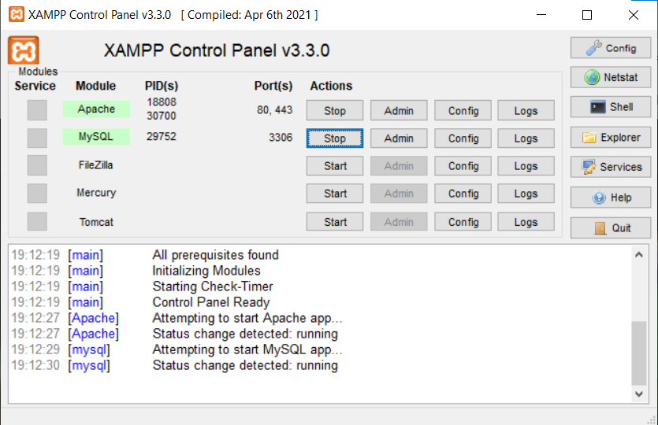

Для проверки работоспособности сервера в браузере открыт адрес `http://localhost` — отобразилась стартовая страница XAMPP, что подтверждает корректную работу Apache.

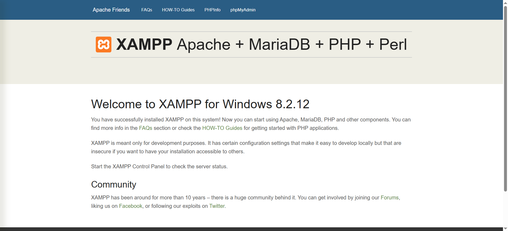

Далее через интерфейс **phpMyAdmin** (`http://localhost/phpmyadmin`) создана новая база данных с именем `wp_lab2`. Именно в неё WordPress будет записывать все свои данные в процессе установки и работы.

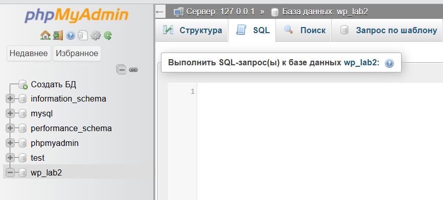

---

### Шаг 2. Установка WordPress

Дистрибутив WordPress скачан с официального сайта [wordpress.org](https://wordpress.org/download) в виде ZIP-архива. Архив распакован, папка переименована в `wp_lab2` и помещена в директорию `C:\xampp\htdocs\wp_lab2`.

В браузере открыт адрес `http://localhost/wp_lab2` — автоматически запустился мастер установки WordPress. На первом экране выбран язык интерфейса.

На следующем шаге введены параметры подключения к базе данных:

| Параметр | Значение |
|---|---|
| Database Name | wp_lab2 |
| Username | root |
| Password | _(пусто)_ |
| Database Host | localhost |
| Table Prefix | wp_ |

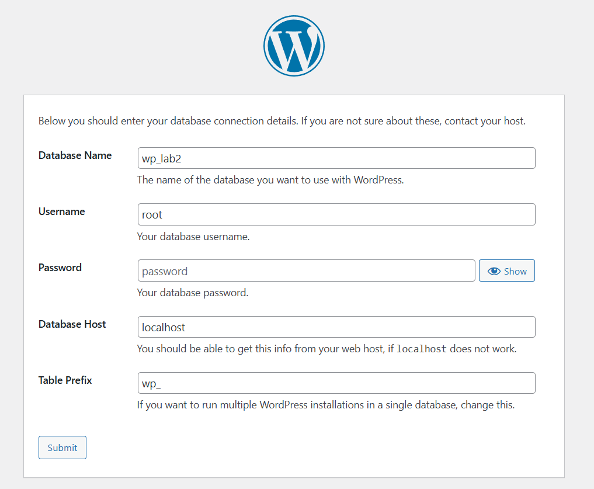

После успешного соединения с базой данных заполнены сведения о сайте: название, логин и пароль администратора, адрес электронной почты. Установка завершена — отображён финальный экран с подтверждением.

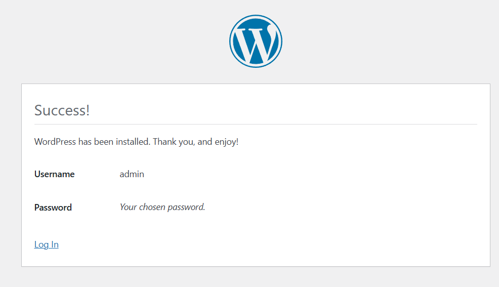

Вход в панель администратора осуществляется по адресу `http://localhost/wp_lab2/wp-admin`.

---

### Шаг 3. Первоначальные настройки сайта

#### 3.1 Общие настройки

В разделе **Settings → General** выполнены следующие изменения:
- **Site Title** — задано название сайта.
- **Tagline** — задано краткое описание (слоган).
- **Timezone** — установлен корректный часовой пояс.

После внесения изменений нажата кнопка **Save Changes**.

#### 3.2 Настройка постоянных ссылок

В разделе **Settings → Permalinks** выбран формат **Post name**. Это позволяет формировать читаемые URL вида `http://localhost/wp_lab2/название-записи/` вместо технических ссылок с числовыми идентификаторами. После выбора нажата кнопка **Save Changes**.

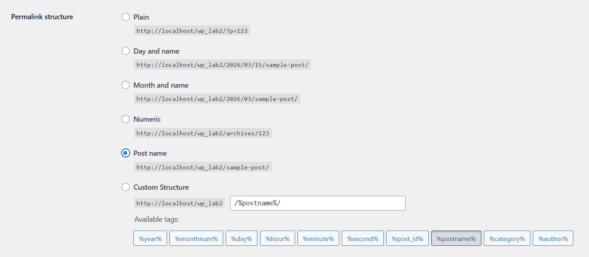

---

### Шаг 4. Работа с темами

#### 4.1 Установка темы Astra

WordPress по умолчанию поставляется со стандартной темой. Для замены открыт раздел **Appearance → Themes → Add New**. В строке поиска введено название **Astra** — одна из самых популярных бесплатных тем WordPress. Тема найдена в каталоге, установлена и активирована.

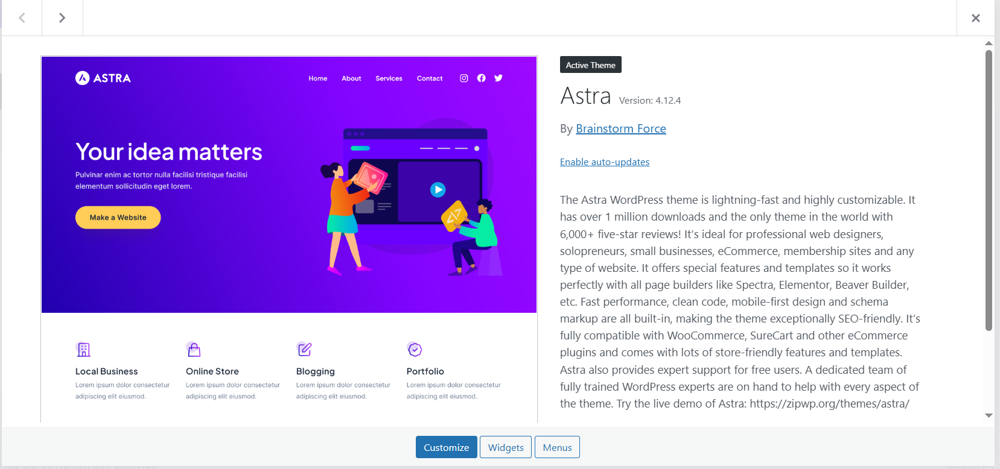

После активации внешний вид сайта кардинально изменился по сравнению со стандартной темой.

#### 4.2 Настройка темы через Customize

Через **Appearance → Customize** открыт встроенный визуальный редактор оформления. В нём выполнены следующие настройки:

- **Site Identity** — загружен логотип сайта, изменены заголовок и описание.
- **Global → Colors** — изменена основная цветовая схема сайта.

Все изменения применяются в режиме реального времени в окне предпросмотра. После настройки нажата кнопка **Publish**.

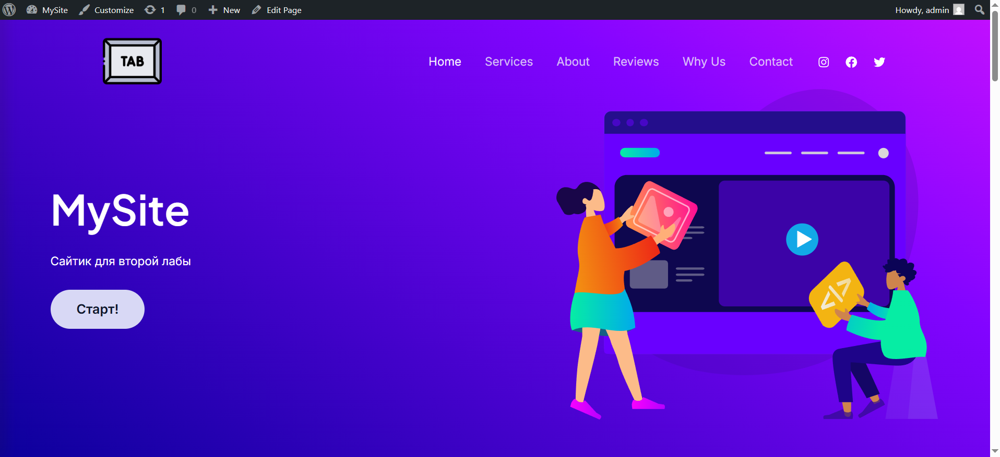

---

### Шаг 5. Работа с плагинами

#### 5.1 Установка плагинов

В разделе **Plugins → Add New** найдены и установлены два плагина:

**Classic Editor** — отключает блочный редактор Gutenberg и возвращает классический текстовый редактор записей, более привычный и простой в использовании.

**Contact Form 7** — один из самых популярных плагинов WordPress. Позволяет создавать настраиваемые формы обратной связи и размещать их на любых страницах сайта с помощью shortcode.

После установки оба плагина активированы.

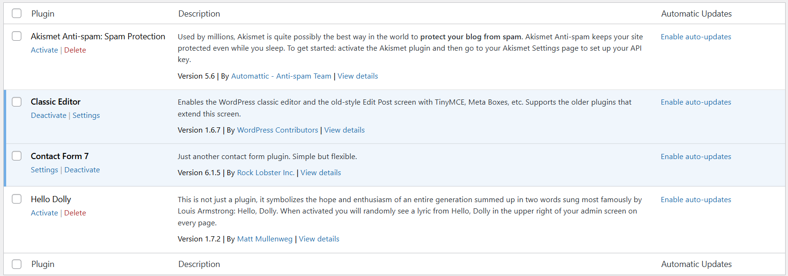

#### 5.2 Проверка Classic Editor

После активации Classic Editor при создании новой записи (**Posts → Add New**) вместо блочного редактора Gutenberg отображается классический редактор с привычной панелью форматирования текста.

#### 5.3 Проверка Contact Form 7

После активации Contact Form 7 в левом меню администратора появился новый раздел **Contact**. В нём автоматически создана форма по умолчанию «Contact form 1» со стандартными полями: имя, email, тема, сообщение.

#### 5.4 Деактивация плагина

Для демонстрации работы механизма плагинов один из них деактивирован через **Plugins → Installed Plugins → Deactivate**. После деактивации соответствующий раздел меню администратора немедленно исчез, что подтверждает: функциональность плагина полностью отключается без удаления его файлов.

---

### Шаг 6. Создание контента

#### 6.1 Страница «Контакты» с формой обратной связи

Для получения shortcode формы открыт раздел **Contact → Contact Forms**. Скопирован shortcode формы «Contact form 1»: `[contact-form-7 id="..." title="Contact form 1"]`.

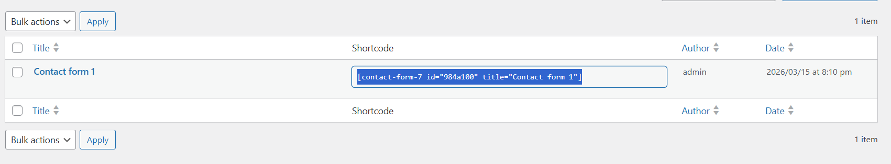

Создана новая страница: **Pages → Add New**. Название страницы — «Контакты». В тело страницы вставлен скопированный shortcode формы. Страница опубликована нажатием кнопки **Publish**.

После публикации страница проверена на фронтенде — форма обратной связи отображается корректно и содержит все стандартные поля.

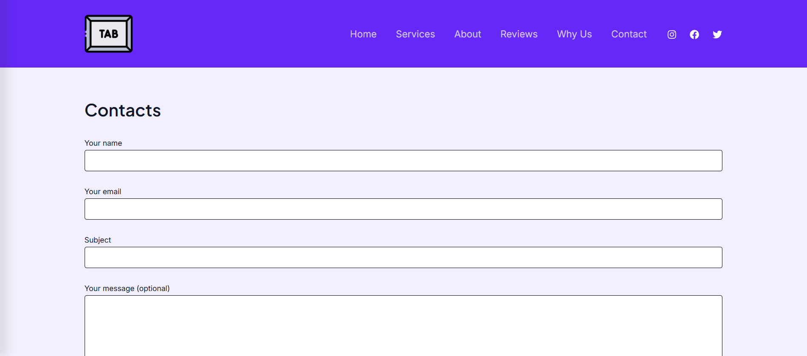

#### 6.2 Записи в блоге

Созданы две записи через **Posts → Add New**.

После заполнения каждая запись опубликована кнопкой **Publish**.

Созданные записи отображаются на главной странице сайта в виде ленты блога.

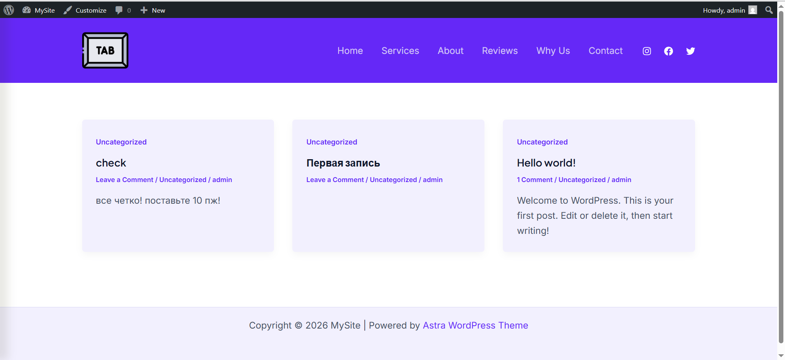

---

## 4. Ответы на контрольные вопросы

**1. Что делает тема в WordPress, а что — плагин?**

Тема отвечает исключительно за визуальное оформление сайта: структуру страниц, шрифты, цвета, расположение блоков (шапка, подвал, сайдбар). При смене темы меняется только внешний вид — контент и настройки остаются нетронутыми.

Плагин расширяет функциональность сайта, не влияя на дизайн. Плагин может добавить форму обратной связи, галерею, SEO-инструменты, интернет-магазин или любую другую возможность. Тема и плагин решают принципиально разные задачи и не заменяют друг друга.

**2. Почему при смене темы контент сайта не теряется?**

Потому что WordPress хранит весь контент (записи, страницы, комментарии, медиафайлы, настройки) в базе данных MySQL, а не внутри файлов темы. Тема — это лишь набор шаблонов, определяющих, как данные из базы отображаются на экране. При смене темы меняется только шаблон отображения, тогда как сами данные в базе остаются полностью нетронутыми.

**3. Как можно изменить внешний вид сайта без редактирования кода?**

Существует несколько способов:
- **Appearance → Customize** — встроенный визуальный редактор WordPress. Позволяет в режиме реального времени менять логотип, цветовую схему, заголовок, шрифты и другие параметры оформления.
- **Настройки темы** — многие темы (например, Astra) имеют собственный расширенный раздел настроек в админ-панели.
- **Визуальные конструкторы** — плагины типа Elementor или WPBakery позволяют строить страницы перетаскиванием блоков без единой строки кода.

---

## 5. Вывод

В ходе выполнения лабораторной работы была успешно развёрнута локальная среда на базе XAMPP и установлен WordPress. Изучены основные разделы административной панели, освоена работа с темами — установка, активация и визуальная кастомизация через инструмент Customize. Установлены и проверены плагины Classic Editor и Contact Form 7, продемонстрирован механизм активации и деактивации плагинов. Создан пользовательский контент: страница с формой обратной связи и несколько записей блога с текстом и изображениями. Получены практические навыки работы с CMS WordPress без редактирования программного кода.
