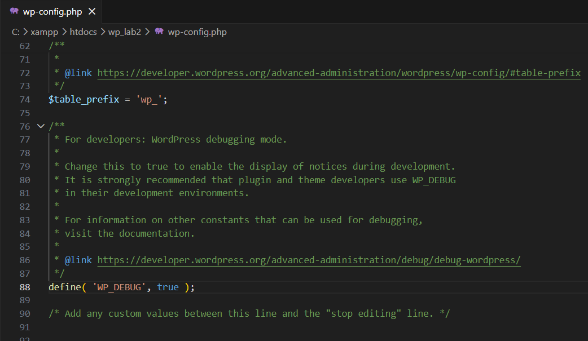
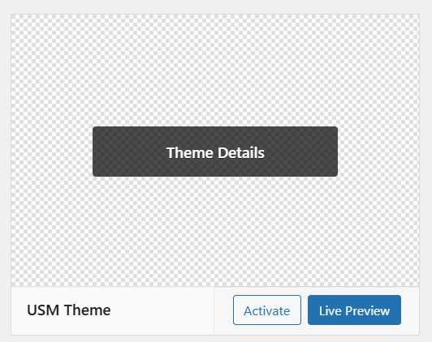
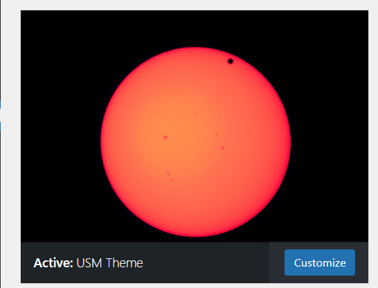
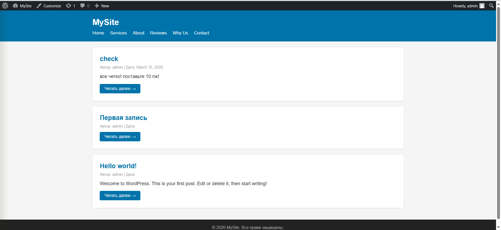
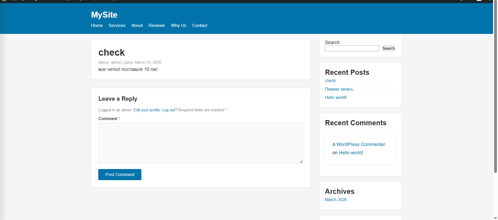

# Лабораторная работа №3. Разработка простой темы WordPress

**Студент:** Mihailov Piotr I2302

**Дата выполнения:** 16.03.2026

---

## 1. Цель работы

Научиться создавать собственную тему WordPress с нуля, разобраться в минимальной структуре темы и принципах работы иерархии шаблонов.

---

## 2. Выполнение работы

### Шаг 1. Подготовка среды

WordPress установлен локально через XAMPP. В директории `wp-content/themes/` была создана папка `usm-theme` — это и есть папка будущей темы. В файле `wp-config.php` найдена строка `define('WP_DEBUG', false)` и изменена на `define('WP_DEBUG', true)`, чтобы в процессе разработки все PHP-ошибки отображались на экране.



---

### Шаг 2. Создание обязательных файлов темы

Для того чтобы WordPress распознал папку как тему, достаточно двух файлов: `style.css` и `index.php`.

Файл `style.css` должен начинаться со специального блока комментариев — это метаданные темы. По полю `Theme Name` WordPress определяет название темы и отображает её в разделе Appearance → Themes. После метаданных в этом же файле размещены все CSS-стили темы.

```css
/*
Theme Name: USM Theme
Author: Mihailov Piotr
Description: Простая тема WordPress, разработанная в рамках лабораторной работы №3.
Version: 1.0
Text Domain: usm-theme
*/

* { margin: 0; padding: 0; box-sizing: border-box; }

body { font-family: Arial, sans-serif; font-size: 16px; color: #333; background: #f5f5f5; }

a { color: #0073aa; text-decoration: none; }
a:hover { text-decoration: underline; }

.container { max-width: 1100px; margin: 0 auto; padding: 0 20px; }

.content-area { display: flex; gap: 30px; }
.primary { flex: 1; }

#site-header { background: #0073aa; color: #fff; padding: 20px 0; }
#site-header .site-title a { color: #fff; font-size: 28px; }
#site-header .site-description { color: #cce5f6; font-size: 14px; }
#site-navigation .nav-menu { list-style: none; display: flex; gap: 20px; margin-top: 10px; }
#site-navigation .nav-menu a { color: #fff; font-size: 15px; }

article { background: #fff; padding: 25px; margin: 20px 0; border-radius: 6px; box-shadow: 0 1px 4px rgba(0,0,0,0.1); }
article h2 a { color: #0073aa; font-size: 22px; }
.post-meta { font-size: 13px; color: #999; margin: 8px 0; }
.post-excerpt { margin: 12px 0; line-height: 1.6; }
.read-more { display: inline-block; background: #0073aa; color: #fff; padding: 8px 16px; border-radius: 4px; font-size: 14px; }
.read-more:hover { background: #005f8e; text-decoration: none; }

#sidebar { width: 280px; flex-shrink: 0; }
.widget { background: #fff; padding: 20px; margin-bottom: 20px; border-radius: 6px; box-shadow: 0 1px 4px rgba(0,0,0,0.1); }
.widget-title { font-size: 16px; margin-bottom: 10px; color: #0073aa; border-bottom: 2px solid #0073aa; padding-bottom: 6px; }

#site-footer { background: #222; color: #aaa; text-align: center; padding: 20px 0; margin-top: 40px; font-size: 14px; }

.archive-title { font-size: 26px; margin: 20px 0; color: #333; }

/* ===== COMMENTS ===== */
#comments { margin-top: 30px; }
#comments h2 { font-size: 20px; margin-bottom: 20px; color: #333; }
.comment-list { list-style: none; padding: 0; }
.comment-list .comment { background: #fff; padding: 20px; margin-bottom: 15px; border-radius: 6px; box-shadow: 0 1px 4px rgba(0,0,0,0.1); }
.comment-author { font-weight: bold; color: #0073aa; }
.comment-metadata { font-size: 13px; color: #999; margin: 4px 0 10px; }
.comment-content p { line-height: 1.6; }

#respond { background: #fff; padding: 25px; margin-top: 20px; border-radius: 6px; box-shadow: 0 1px 4px rgba(0,0,0,0.1); }
#respond h3 { font-size: 20px; margin-bottom: 20px; color: #333; }
.comment-form label { display: block; font-size: 14px; font-weight: bold; margin-bottom: 5px; color: #555; }
.comment-form input[type="text"],
.comment-form input[type="email"],
.comment-form input[type="url"],
.comment-form textarea { width: 100%; padding: 10px 12px; border: 1px solid #ddd; border-radius: 4px; font-size: 14px; font-family: Arial, sans-serif; background: #fafafa; margin-bottom: 15px; }
.comment-form input[type="text"]:focus,
.comment-form input[type="email"]:focus,
.comment-form textarea:focus { outline: none; border-color: #0073aa; background: #fff; }
.comment-form textarea { height: 140px; resize: vertical; }
.comment-form input[type="submit"],
#respond input[type="submit"] { background: #0073aa; color: #fff; border: none; padding: 10px 24px; border-radius: 4px; font-size: 15px; cursor: pointer; }
.comment-form input[type="submit"]:hover { background: #005f8e; }
.comment-notes, .logged-in-as { font-size: 13px; color: #888; margin-bottom: 15px; }

/* ===== SIDEBAR WIDGETS ===== */
.widget ul { list-style: none; padding: 0; margin: 0; }
.widget ul li { padding: 6px 0; border-bottom: 1px solid #f0f0f0; font-size: 14px; }
.widget ul li:last-child { border-bottom: none; }
.widget ul li a { color: #0073aa; }
.widget ul li a:hover { text-decoration: underline; }
.widget_search .search-form { display: flex; gap: 8px; }
.widget_search input[type="search"] { flex: 1; padding: 8px 10px; border: 1px solid #ddd; border-radius: 4px; font-size: 14px; }
.widget_search input[type="search"]:focus { outline: none; border-color: #0073aa; }
.widget_search input[type="submit"] { background: #0073aa; color: #fff; border: none; padding: 8px 14px; border-radius: 4px; font-size: 14px; cursor: pointer; }
.widget_search input[type="submit"]:hover { background: #005f8e; }
```

Файл `index.php` является главным шаблоном темы. Он подключает шапку и подвал через `get_header()` и `get_footer()`, а внутри реализует цикл WordPress — стандартный механизм вывода записей. Для вывода ровно 5 последних записей используется `WP_Query` с параметром `posts_per_page=5` — это более правильный подход по сравнению с `query_posts()`, так как не нарушает основной запрос WordPress. Цикл перебирает записи одну за другой, выводя заголовок, автора, дату, краткое описание и ссылку «Читать далее».

```php
<?php get_header(); ?>

<main id="main-content">
    <div class="container">
        <?php
        $args = array( 'posts_per_page' => 5 );
        $query = new WP_Query( $args );
        ?>

        <?php if ( $query->have_posts() ) : ?>
            <?php while ( $query->have_posts() ) : $query->the_post(); ?>
                <article id="post-<?php the_ID(); ?>" <?php post_class(); ?>>
                    <h2><a href="<?php the_permalink(); ?>"><?php the_title(); ?></a></h2>
                    <div class="post-meta">
                        Автор: <?php the_author(); ?> | Дата: <?php the_date(); ?>
                    </div>
                    <div class="post-excerpt">
                        <?php the_excerpt(); ?>
                    </div>
                    <a href="<?php the_permalink(); ?>" class="read-more">Читать далее →</a>
                </article>
            <?php endwhile; ?>
            <?php wp_reset_postdata(); ?>
        <?php else : ?>
            <p>Записей не найдено.</p>
        <?php endif; ?>
    </div>
</main>

<?php get_footer(); ?>
```

После создания этих двух файлов тема уже появляется в разделе Appearance → Themes в административной панели.



---

### Шаг 3. Общие части шаблонов

Чтобы не дублировать HTML шапки и подвала в каждом шаблоне, они вынесены в отдельные файлы. Файл `header.php` содержит всё от `<!DOCTYPE html>` до начала основного контента. Ключевой момент — вызов функции `wp_head()` перед закрывающим тегом `</head>`: без неё WordPress не подключит стили и скрипты плагинов.

```php
<!DOCTYPE html>
<html <?php language_attributes(); ?>>
<head>
    <meta charset="<?php bloginfo('charset'); ?>">
    <meta name="viewport" content="width=device-width, initial-scale=1.0">
    <?php wp_head(); ?>
</head>
<body <?php body_class(); ?>>

<header id="site-header">
    <div class="container">
        <h1 class="site-title">
            <a href="<?php echo esc_url( home_url('/') ); ?>">
                <?php bloginfo('name'); ?>
            </a>
        </h1>
        <p class="site-description"><?php bloginfo('description'); ?></p>
        <nav id="site-navigation">
            <?php wp_nav_menu( array( 'theme_location' => 'primary', 'menu_class' => 'nav-menu' ) ); ?>
        </nav>
    </div>
</header>
```

Файл `footer.php` содержит подвал и закрывающие теги документа. Функция `wp_footer()` перед `</body>` обязательна — многие плагины вставляют свои JavaScript-скрипты именно в это место.

```php
<footer id="site-footer">
    <div class="container">
        <p>&copy; <?php echo date('Y'); ?> <?php bloginfo('name'); ?>. Все права защищены.</p>
    </div>
</footer>

<?php wp_footer(); ?>
</body>
</html>
```

---

### Шаг 4. Файл функций

Файл `functions.php` загружается автоматически при каждом запросе, пока тема активна. Здесь подключаются стили через хук `wp_enqueue_scripts` — это правильный способ добавления CSS в WordPress, в отличие от прямого тега `<link>` в шапке. Такой подход позволяет WordPress управлять порядком загрузки ресурсов и разрешать зависимости между ними. В этом же файле регистрируется меню навигации и виджет-зона для боковой панели.

```php
<?php

function usm_theme_scripts() {
    wp_enqueue_style( 'usm-theme-style', get_stylesheet_uri(), array(), '1.0' );
}
add_action( 'wp_enqueue_scripts', 'usm_theme_scripts' );

function usm_theme_setup() {
    register_nav_menus( array( 'primary' => 'Основное меню' ) );
    add_theme_support( 'post-thumbnails' );
    add_theme_support( 'title-tag' );
}
add_action( 'after_setup_theme', 'usm_theme_setup' );

function usm_theme_widgets_init() {
    register_sidebar( array(
        'name'          => 'Боковая панель',
        'id'            => 'sidebar-1',
        'before_widget' => '<div class="widget">',
        'after_widget'  => '</div>',
        'before_title'  => '<h3 class="widget-title">',
        'after_title'   => '</h3>',
    ) );
}
add_action( 'widgets_init', 'usm_theme_widgets_init' );
```

---

### Шаг 5. Дополнительные шаблоны

Файл `single.php` используется при открытии отдельного поста. В отличие от `index.php`, он выводит полный текст записи через `the_content()`, а также подключает боковую панель и блок комментариев.

```php
<?php get_header(); ?>

<main id="main-content">
    <div class="container content-area">
        <div class="primary">
            <?php if ( have_posts() ) : while ( have_posts() ) : the_post(); ?>
                <article id="post-<?php the_ID(); ?>" <?php post_class(); ?>>
                    <h1><?php the_title(); ?></h1>
                    <div class="post-meta">Автор: <?php the_author(); ?> | Дата: <?php the_date(); ?></div>
                    <div class="post-content"><?php the_content(); ?></div>
                </article>
                <?php comments_template(); ?>
            <?php endwhile; endif; ?>
        </div>
        <?php get_sidebar(); ?>
    </div>
</main>

<?php get_footer(); ?>
```

Файл `page.php` используется для статических страниц WordPress, например «О нас» или «Контакты». Он аналогичен `single.php`, но не выводит дату публикации, так как для страниц она нерелевантна.

```php
<?php get_header(); ?>

<main id="main-content">
    <div class="container content-area">
        <div class="primary">
            <?php if ( have_posts() ) : while ( have_posts() ) : the_post(); ?>
                <article id="post-<?php the_ID(); ?>" <?php post_class(); ?>>
                    <h1><?php the_title(); ?></h1>
                    <div class="post-content"><?php the_content(); ?></div>
                </article>
                <?php comments_template(); ?>
            <?php endwhile; endif; ?>
        </div>
        <?php get_sidebar(); ?>
    </div>
</main>

<?php get_footer(); ?>
```

Файл `sidebar.php` выводит зарегистрированную виджет-зону. Если администратор ещё не добавил виджеты, функция `is_active_sidebar()` вернёт `false` и вместо пустого блока отобразится заглушка по умолчанию.

```php
<aside id="sidebar">
    <?php if ( is_active_sidebar('sidebar-1') ) : ?>
        <?php dynamic_sidebar('sidebar-1'); ?>
    <?php else : ?>
        <div class="widget">
            <h3 class="widget-title">О сайте</h3>
            <p>Добавьте виджеты через Appearance → Widgets.</p>
        </div>
    <?php endif; ?>
</aside>
```

Файл `comments.php` подключается из `single.php` и `page.php` через `comments_template()`. В начале файла стоит проверка `post_password_required()` — она предотвращает показ комментариев для постов, защищённых паролем.

```php
<?php if ( post_password_required() ) return; ?>

<div id="comments">
    <?php if ( have_comments() ) : ?>
        <h2>Комментарии (<?php comments_number('0', '1', '%'); ?>)</h2>
        <ol class="comment-list">
            <?php wp_list_comments( array( 'style' => 'ol' ) ); ?>
        </ol>
        <?php the_comments_pagination(); ?>
    <?php endif; ?>

    <?php if ( comments_open() ) : ?>
        <?php comment_form(); ?>
    <?php else : ?>
        <p>Комментарии закрыты.</p>
    <?php endif; ?>
</div>
```

Файл `archive.php` используется для страниц архивов по категории, тегу, дате или автору. Функция `the_archive_title()` автоматически формирует заголовок в зависимости от типа архива, а `the_posts_pagination()` выводит пагинацию.

```php
<?php get_header(); ?>

<main id="main-content">
    <div class="container">
        <h1 class="archive-title"><?php the_archive_title(); ?></h1>

        <?php if ( have_posts() ) : ?>
            <?php while ( have_posts() ) : the_post(); ?>
                <article id="post-<?php the_ID(); ?>" <?php post_class(); ?>>
                    <h2><a href="<?php the_permalink(); ?>"><?php the_title(); ?></a></h2>
                    <div class="post-meta"><?php the_date(); ?> | <?php the_author(); ?></div>
                    <?php the_excerpt(); ?>
                </article>
            <?php endwhile; ?>
            <?php the_posts_pagination(); ?>
        <?php else : ?>
            <p>Записей не найдено.</p>
        <?php endif; ?>
    </div>
</main>

<?php get_footer(); ?>
```

---

### Шаг 6. Активация темы

В разделе **Appearance → Themes** найдена тема USM Theme и нажата кнопка **Activate**. После активации сайт начал использовать созданные шаблоны и стили.







---

## 3. Структура проекта

```
usm-theme/
├── style.css       — метаданные темы + все стили
├── index.php       — главный шаблон (список постов)
├── functions.php   — стили, меню, виджет-зоны
├── header.php      — шапка (<head>, <header>)
├── footer.php      — подвал + wp_footer()
├── sidebar.php     — боковая панель
├── single.php      — отдельный пост
├── page.php        — статическая страница
├── archive.php     — архив записей
├── comments.php    — комментарии
└── screenshot.png  — превью темы (1200×900px)
```

---

## 4. Ответы на контрольные вопросы

**1. Какие два файла являются обязательными для любой темы WordPress?**

`style.css` и `index.php`. В `style.css` должен присутствовать блок метаданных с полем `Theme Name` — именно по нему WordPress определяет папку как тему и отображает её в списке доступных тем. `index.php` является главным резервным шаблоном: если WordPress не находит более специализированный файл (например, `single.php` или `page.php`), он всегда возвращается к `index.php`.

**2. Как подключаются общие части шаблонов (header, footer, sidebar)?**

С помощью специальных функций WordPress: `get_header()` подключает `header.php`, `get_footer()` — `footer.php`, `get_sidebar()` — `sidebar.php`. Эти функции ищут соответствующие файлы в папке активной темы. Для комментариев используется отдельная функция `comments_template()`.

**3. Чем отличаются index.php, single.php и page.php?**

`index.php` — резервный шаблон для любого типа контента, выводит список постов с кратким описанием. `single.php` используется при открытии отдельной записи блога — выводит полный текст и подключает комментарии. `page.php` предназначен для статических страниц WordPress и отличается от `single.php` тем, что не выводит дату публикации, так как страницы обычно не привязаны к конкретному времени.

**4. Зачем нужен файл functions.php в теме?**

`functions.php` — это «плагин» темы, он загружается автоматически при каждом запросе страницы. Через него стили и скрипты подключаются правильным способом через `wp_enqueue_style()` и `wp_enqueue_script()`, что позволяет WordPress управлять порядком их загрузки. Также в `functions.php` регистрируются меню навигации, виджет-зоны и включаются дополнительные возможности WordPress через `add_theme_support()`.

---

## 5. Вывод

В ходе выполнения лабораторной работы была создана кастомная тема WordPress с нуля. Реализованы два обязательных файла и восемь дополнительных шаблонов, разобрана иерархия шаблонов WordPress и принцип резервного перехода к `index.php`. Стили подключены через `functions.php` с использованием механизма `wp_enqueue_style`. Тема успешно активирована и корректно отображает главную страницу со списком постов, страницы отдельных записей с боковой панелью и комментариями, статические страницы и архивы.

**Репозиторий:** [ссылка на GitHub/GitLab]

---

## 6. Источники

1. WordPress Theme Handbook — https://developer.wordpress.org/themes/
2. Template Hierarchy — https://developer.wordpress.org/themes/basics/template-hierarchy/
3. Template Tags — https://developer.wordpress.org/themes/references/list-of-template-tags/
4. wp_enqueue_style() — https://developer.wordpress.org/reference/functions/wp_enqueue_style/