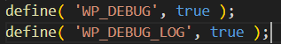
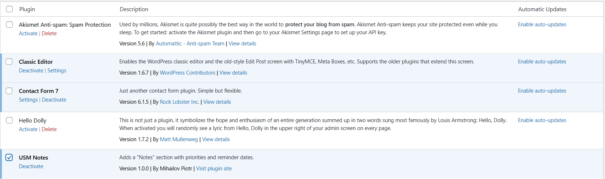
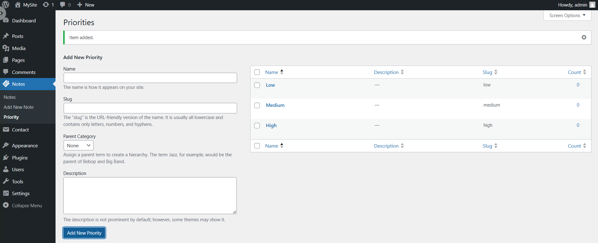
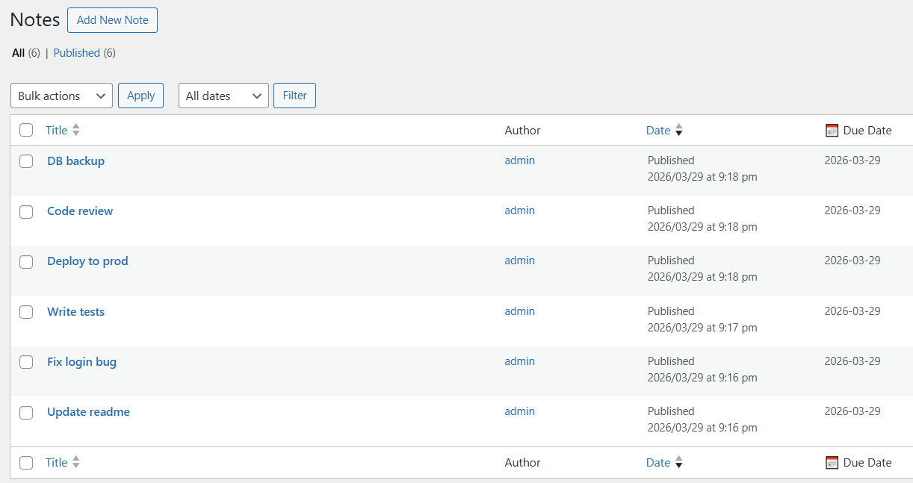
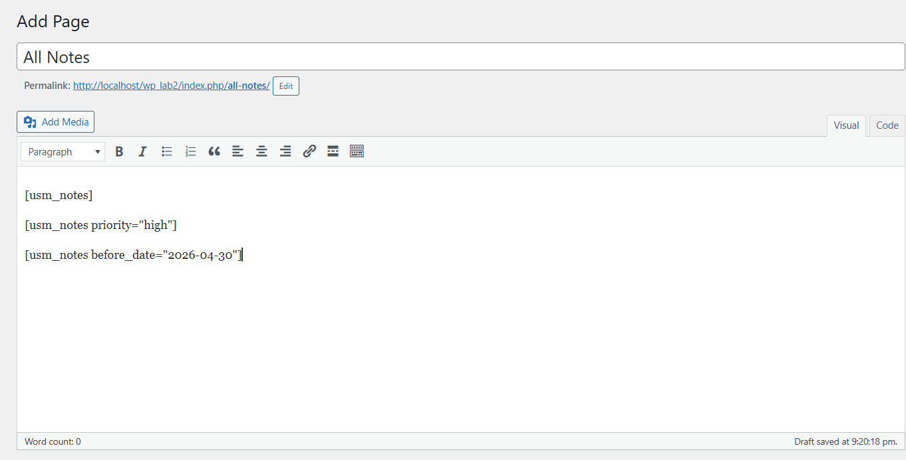
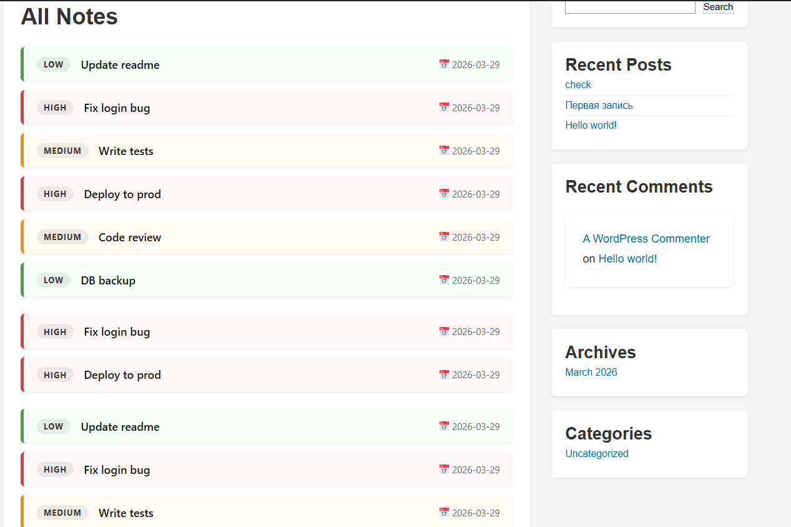

# Лабораторная работа №4. Разработка плагина для WordPress

**Студент:** Mihailov Piotr I2302

**Дата выполнения:** 29.03.2026

## 1. Цель работы

Освоить расширяемую модель данных WordPress: создать CPT (Custom Post Type), пользовательскую таксономию, метаданные с метабоксом в административной панели, а также реализовать шорткод для отображения данных на сайте.

---

## 2. Выполнение работы

### Шаг 1. Подготовка среды

WordPress установлен локально через XAMPP. В директории `wp-content/plugins/` была создана папка `usm-notes` — это папка будущего плагина, а внутри неё папка `assets/` для стилей. В файле `wp-config.php` найдена строка `define('WP_DEBUG', false)` и изменена на `define('WP_DEBUG', true)`, чтобы в процессе разработки все PHP-ошибки отображались на экране.



---

### Шаг 2. Создание основного файла плагина

Для того чтобы WordPress распознал папку как плагин, необходим файл `usm-notes.php` со специальным блоком метаданных в виде комментария в начале файла. По полю `Plugin Name` WordPress определяет название плагина и отображает его в разделе Plugins. Строка проверки `ABSPATH` предотвращает прямой доступ к PHP-файлу из браузера.

```php
<?php
/**
 * Plugin Name: USM Notes
 * Plugin URI:  https://github.com/mihailovp04
 * Description: Adds a "Notes" section with priorities and reminder dates.
 * Version:     1.0.0
 * Author:      Mihailov Piotr
 * License:     GPL2
 */

if ( ! defined( 'ABSPATH' ) ) {
    exit; // Запрет прямого доступа к файлу
}
```

После создания этого файла плагин уже появляется в разделе Plugins в административной панели. Была нажата кнопка **Activate** — ошибок нет.



### Шаг 3. Регистрация Custom Post Type (CPT)

Custom Post Type — это пользовательский тип записи, аналогичный встроенным Posts и Pages, но определяемый разработчиком. CPT регистрируется функцией `register_post_type()`, привязанной к хуку `init`. Параметр `public` делает тип видимым на фронтенде и в админке, `has_archive` создаёт страницу-архив по адресу `/notes/`, параметр `supports` определяет доступные блоки редактора, а `menu_icon` задаёт иконку в административном меню.

```php
function usm_register_notes_cpt() {
    $labels = [
        'name'               => 'Notes',
        'singular_name'      => 'Note',
        'menu_name'          => 'Notes',
        'add_new_item'       => 'Add New Note',
        'edit_item'          => 'Edit Note',
        'not_found'          => 'No notes found',
        'not_found_in_trash' => 'No notes found in Trash',
    ];

    register_post_type( 'usm_note', [
        'labels'       => $labels,
        'public'       => true,
        'has_archive'  => true,
        'supports'     => [ 'title', 'editor', 'author', 'thumbnail' ],
        'menu_icon'    => 'dashicons-clipboard',
        'rewrite'      => [ 'slug' => 'notes' ],
        'show_in_rest' => true,
    ] );
}
add_action( 'init', 'usm_register_notes_cpt' );
```

После сохранения файла в левом меню WordPress появился раздел **Notes** с иконкой буфера обмена. После регистрации CPT обязательно нужно зайти в **Settings → Permalinks** и нажать **Save Changes** — это обновляет `.htaccess` и активирует URL `/notes/`.

---

### Шаг 4. Регистрация пользовательской таксономии

Таксономия — это система классификации записей. В отличие от метаполей, термины таксономии являются общими для множества записей и позволяют создавать архивные страницы и фильтры. Таксономия `usm_priority` регистрируется функцией `register_taxonomy()` и привязывается к CPT `usm_note`. Параметр `hierarchical: true` делает её похожей на категории (с возможностью вложенности), а не на теги.

```php
function usm_register_priority_taxonomy() {
    $labels = [
        'name'          => 'Priorities',
        'singular_name' => 'Priority',
        'all_items'     => 'All Priorities',
        'edit_item'     => 'Edit Priority',
        'add_new_item'  => 'Add New Priority',
        'menu_name'     => 'Priority',
    ];

    register_taxonomy( 'usm_priority', 'usm_note', [
        'labels'       => $labels,
        'hierarchical' => true,
        'public'       => true,
        'rewrite'      => [ 'slug' => 'priority' ],
        'show_in_rest' => true,
    ] );
}
add_action( 'init', 'usm_register_priority_taxonomy' );
```

После регистрации таксономии в подменю **Notes** появился пункт **Priority**. Там были созданы три термина:

| Name   | Slug   |
|--------|--------|
| High   | high   |
| Medium | medium |
| Low    | low    |



---

### Шаг 5. Добавление метабокса для даты напоминания

Метабокс — это блок пользовательского интерфейса в редакторе записи. Он добавляется функцией `add_meta_box()` и позволяет редактировать метаданные записи через удобную форму прямо в административной панели. В метабоксе размещено поле `input[type="date"]` с атрибутом `min`, равным сегодняшней дате, — это блокирует выбор прошедших дат на уровне браузерного UI.

Наиболее интересной частью реализации является механизм отображения ошибок валидации прямо внутри метабокса. WordPress не предоставляет встроенного способа прервать сохранение и показать ошибку в редакторе. Для решения этой задачи используется механизм транзиентов — временного хранилища в базе данных: при ошибке сообщение сохраняется через `set_transient()`, а при следующей отрисовке метабокса считывается и удаляется.

```php
// При ошибке — сохраняем сообщение во временное хранилище
if ( empty( $_POST['usm_due_date'] ) ) {
    set_transient( 'usm_due_date_error_' . $post_id, 'Due date is required!', 45 );
    return;
}

$date  = sanitize_text_field( $_POST['usm_due_date'] );
$today = date( 'Y-m-d' );

// Дата не может быть в прошлом
if ( $date < $today ) {
    set_transient( 'usm_due_date_error_' . $post_id, 'Due date cannot be in the past!', 45 );
    return;
}

update_post_meta( $post_id, '_usm_due_date', $date );
```

Для защиты от CSRF-атак используется nonce-токен: он генерируется при отображении формы через `wp_nonce_field()` и проверяется при сохранении через `wp_verify_nonce()`. Без этой проверки злоумышленник мог бы отправить поддельный запрос от имени авторизованного администратора и изменить метаданные любой записи.

Дополнительно в список записей CPT добавлена колонка **Due Date**, отображающая сохранённую дату напоминания для каждой заметки.



---

### Шаг 6. Создание шорткода для отображения заметок

Шорткод `[usm_notes]` регистрируется функцией `add_shortcode()` и поддерживает два необязательных атрибута: `priority` (фильтр по таксономии) и `before_date` (фильтр по метаданным). При отсутствии атрибутов отображаются все опубликованные заметки. Фильтрация реализована через `WP_Query` с параметрами `tax_query` и `meta_query`. Если заметок не найдено — выводится сообщение «Нет заметок с заданными параметрами».

```php
function usm_notes_shortcode( $atts ) {
    $atts = shortcode_atts( [
        'priority'    => '',
        'before_date' => '',
    ], $atts, 'usm_notes' );

    $args = [
        'post_type'      => 'usm_note',
        'post_status'    => 'publish',
        'posts_per_page' => -1,
        'orderby'        => 'meta_value',
        'meta_key'       => '_usm_due_date',
        'order'          => 'ASC',
    ];

    // Фильтр по приоритету (таксономия)
    if ( ! empty( $atts['priority'] ) ) {
        $args['tax_query'] = [ [
            'taxonomy' => 'usm_priority',
            'field'    => 'slug',
            'terms'    => sanitize_text_field( $atts['priority'] ),
        ] ];
    }

    // Фильтр по дате (метаданные)
    if ( ! empty( $atts['before_date'] ) ) {
        $args['meta_query'] = [ [
            'key'     => '_usm_due_date',
            'value'   => sanitize_text_field( $atts['before_date'] ),
            'compare' => '<=',
            'type'    => 'DATE',
        ] ];
    }

    $query = new WP_Query( $args );

    if ( ! $query->have_posts() ) {
        return '<p class="usm-notes-empty">Нет заметок с заданными параметрами.</p>';
    }
    // ... вывод заметок
}
add_shortcode( 'usm_notes', 'usm_notes_shortcode' );
```

Каждая заметка получает CSS-класс `usm-priority-{slug}`, что позволяет применять разные стили по приоритету: красная полоса для High, оранжевая для Medium, зелёная для Low. Стили подключаются через `wp_enqueue_style()` на хуке `wp_enqueue_scripts`.

---

### Шаг 7. Тестирование плагина

Для тестирования созданы 6 заметок с разными приоритетами:

| Заголовок      | Priority | Due Date   |
|----------------|----------|------------|
| Fix login bug  | High     | 2026-03-29 |
| Deploy to prod | High     | 2026-03-29 |
| Write tests    | Medium   | 2026-03-29 |
| Code review    | Medium   | 2026-03-29 |
| Update readme  | Low      | 2026-03-29 |
| DB backup      | Low      | 2026-03-29 |

Создана страница **All Notes**, в редактор которой вставлены три варианта шорткода:

```
[usm_notes]

[usm_notes priority="high"]

[usm_notes before_date="2026-04-30"]
```



После публикации страница открыта на фронтенде — заметки отображаются карточками с цветными полосами по приоритету, бейджем приоритета и датой напоминания.




## 4. Ответы на контрольные вопросы

**1. Чем пользовательская таксономия принципиально отличается от метаполя? Приведи пример, когда выбрать таксономию, а когда — метаданные.**

Таксономия — это система классификации, общая для множества записей. Термины (например, High, Medium, Low) существуют независимо от конкретных заметок, индексируются WordPress и позволяют создавать архивные страницы (`/priority/high/`) и фильтровать записи через стандартный интерфейс. Метаполе — это уникальное значение, жёстко привязанное к одной конкретной записи и не предназначенное для совместного использования.

Таксономию выбирают, когда нужна группировка, навигация и архивные страницы — например, приоритет задачи, жанр книги, тип товара. Метаполе выбирают, когда данные уникальны для каждой записи — например, дата напоминания, цена продукта, GPS-координаты.

**2. Зачем нужен nonce при сохранении метаполей и что произойдёт, если его не проверять?**

Nonce (number used once) — одноразовый токен безопасности. WordPress генерирует его при отображении формы через `wp_nonce_field()` и проверяет при получении данных через `wp_verify_nonce()`. Его задача — защита от CSRF-атак (Cross-Site Request Forgery): злоумышленник не может узнать значение токена заранее, поэтому не может сформировать поддельный запрос от имени авторизованного пользователя.

Без проверки nonce любой сторонний сайт мог бы отправить скрытую форму от имени администратора WordPress и изменить метаданные любой записи — например, очистить дату напоминания или подменить содержимое. Токен привязан к конкретному действию, пользователю и имеет ограниченный срок жизни (~12 часов).

**3. Какие аргументы register_post_type() и register_taxonomy() чаще всего важны для фронтенда и UX (назови минимум три и объясни почему).**

`public` — определяет видимость типа на фронтенде и в административной панели. Без этого параметра CPT существует только в коде, недоступен пользователям и не имеет собственного URL — это делает его бесполезным с точки зрения UX.

`has_archive` — создаёт страницу-архив (например, `/notes/`), на которой автоматически выводятся все записи данного типа. Это важно для навигации пользователя и SEO: у пользователя появляется единая точка входа для просмотра всех заметок.

`labels` — определяет все текстовые подписи в административном интерфейсе: заголовки разделов, кнопки добавления, сообщения об отсутствии записей. Без корректных меток интерфейс выглядит шаблонно (Post / Posts вместо Note / Notes), что ухудшает UX администратора.

`rewrite` — задаёт slug для формирования человекочитаемых URL (`/notes/`, `/priority/high/`). Красивые и понятные URL улучшают как пользовательский опыт навигации, так и поисковую оптимизацию сайта.

---

## 5. Вывод

В ходе выполнения лабораторной работы был разработан плагин USM Notes для системы управления контентом WordPress. Реализован полный цикл работы с пользовательскими данными: регистрация Custom Post Type, создание иерархической таксономии, добавление метабокса с валидацией даты и nonce-защитой, сохранение и чтение метаданных, а также создание шорткода с фильтрацией через `WP_Query`.

Особый интерес представило решение задачи отображения ошибок валидации непосредственно в метабоксе с использованием механизма транзиентов WordPress как альтернативы сессиям. Плагин успешно протестирован: шорткод корректно отображает заметки с цветовой индикацией приоритета и фильтрацией по таксономии и дате.

---

## 6. Источники

1. WordPress Developer Resources. `register_post_type()` — https://developer.wordpress.org/reference/functions/register_post_type/
2. WordPress Developer Resources. `register_taxonomy()` — https://developer.wordpress.org/reference/functions/register_taxonomy/
3. WordPress Developer Resources. `add_meta_box()` — https://developer.wordpress.org/reference/functions/add_meta_box/
4. WordPress Developer Resources. `WP_Query` — https://developer.wordpress.org/reference/classes/wp_query/
5. WordPress Developer Resources. Nonces — https://developer.wordpress.org/apis/security/nonces/
6. WordPress Developer Resources. Shortcode API — https://codex.wordpress.org/Shortcode_API
7. WordPress Plugin Handbook — https://developer.wordpress.org/plugins/
